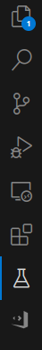
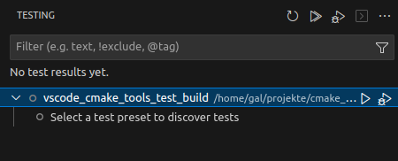

# VSCode CMake tools run non-built tests

The VSCode extention ["CMake Tools"](https://marketplace.visualstudio.com/items?itemName=ms-vscode.cmake-tools) 1.15.31
enforces build step to list tests.

With plain CMake it is possible to create a build cache and list tests without
building:

```shell
cmake --preset=my_default
# List tests:
ctest --preset=my_default -N
# Run helper test:
ctest --preset=my_default -R helper
```

Please note that CMake is able to list the tests `exe_test` and `helper`.
The test `helper` can be executed without a build since it does not
depend on C sources.

## Steps to reproduce in VS Code

Select configure preset `my_default`. The build cache is initialized.

Switch to the testing tab on the left:



The plugin suggests to select a test preset in order to show the list of tests:



Select the test preset `my_default`.

In the OUTPUT pane you can see that the plugins run the test builds:

```text
[driver] Switching to test preset: my_default
[main] Building folder: vscode_cmake_tools_test_build 
[build] Starting build
[proc] Executing command: /usr/bin/cmake --build /home/gal/projekte/cmake_playground/vscode_cmake_tools_test_build/build/my_default
[build] [ 50%] Building C object CMakeFiles/exe.dir/main.c.o
[build] [100%] Linking C executable exe
[build] [100%] Built target exe
[driver] Build completed: 00:00:00.273
[build] Build finished with exit code 0
```
